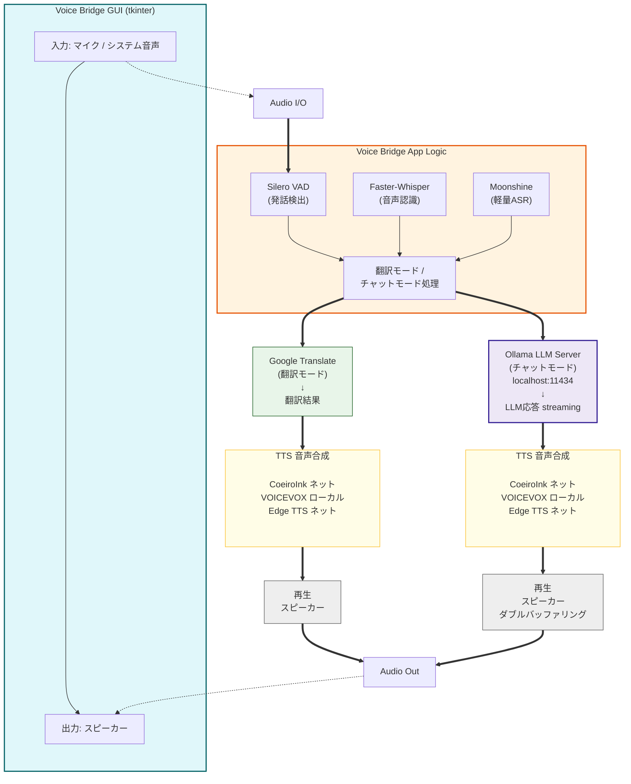

# Voice Bridge

リアルタイム音声翻訳 & AI チャットアプリ。2つのモードで使えます。

**翻訳モード** — システム音声をキャプチャして、音声認識 → 翻訳 → 音声合成をリアルタイムに行います。YouTube の英語動画を日本語音声で聞く、といった使い方ができます。

**チャットモード** — マイクで話しかけると、ローカル LLM が音声で返答します。VOICEVOX・CoeiroInk と組み合わせれば、ずんだもん・リリンちゃんと音声で会話できます。

## 主な機能

- リアルタイム多言語翻訳（7言語対応）
- ローカル LLM による AI 音声チャット（Ollama / LM Studio 等）
- 複数の TTS エンジン対応 — CoeiroInk（リリンちゃん）、VOICEVOX（ずんだもん等）、Edge TTS
- Silero VAD による自然な発話検出
- LLM ストリーミング + TTS ダブルバッファリングで低遅延応答
- GUI でモード・ASR エンジン・LLM モデルを切り替え可能

## デモ

```
あなた: こんにちは
   AI: こんにちは！どうぞ、何でもお手伝いします。（VOICEVOX:ずんだもん で読み上げ）
       遅延: 0.9s（初回音声 0.4s）
```

## 対応言語

英語 / 日本語 / 中国語 / スペイン語 / フランス語 / ドイツ語 / 韓国語

> **Note:** Moonshine エンジン使用時は en / ja / zh / es / ko の5言語に対応（fr, de は未対応）。

## 動作環境

- Python 3.9+
- macOS 10.12+ / Windows 10・11 / Linux（PulseAudio or PipeWire）
- メモリ 4GB以上（8GB推奨）

## セットアップ

### 1. インストール

```bash
git clone https://github.com/zephel01/voice-bridge.git
cd voice-bridge
python3 -m venv venv && source venv/bin/activate   # macOS / Linux
# python -m venv venv && venv\Scripts\activate      # Windows
pip install -r requirements.txt
```

> **Linux の場合:** PortAudio と tkinter が必要です。
> ```bash
> # Ubuntu / Debian
> sudo apt install portaudio19-dev python3-tk
> # Fedora
> sudo dnf install portaudio-devel python3-tkinter
> ```

### 2. 音声キャプチャの準備（翻訳モード用）

**Windows** — 設定不要（WASAPIループバックで自動キャプチャ）

**macOS** — BlackHole（仮想オーディオデバイス）が必要です。

```bash
brew install blackhole-2ch
```

インストール後、Audio MIDI設定で複合デバイスを作成してください。詳細は [docs/BLACKHOLE_QUICK_START.md](docs/BLACKHOLE_QUICK_START.md) を参照。

**Linux** — PulseAudio / PipeWire のモニターデバイスでシステム音声をキャプチャできます。

```bash
# モニターデバイスの確認
python main.py --list-devices
# 出力に "Monitor of ..." があればシステム音声キャプチャ可能
# 例: python main.py --device "Monitor of Built-in Audio"
```

**Linux 音声キャプチャのセットアップ**

PulseAudio 環境でモニターデバイスが見当たらない場合：

```bash
# PulseAudio の負荷モジュールを確認
pactl list modules | grep loopback

# ない場合は負荷
pactl load-module module-loopback latency_msec=1

# モニターデバイスの確認
pactl list sources | grep Monitor
```

PipeWire 環境の場合：

```bash
# pipewire-pulse がインストール済み確認
apt list --installed | grep pipewire-pulse

# ない場合はインストール
sudo apt install pipewire-pulse

# サービス再起動
systemctl restart --user pipewire pipewire-pulse
```

> チャットモードではマイクを直接使うため、ループバック設定は不要です。

> **トラブル時:** Linux でシステム音声がキャプチャできない場合は、 [docs/LINUX_TROUBLESHOOTING.md](docs/LINUX_TROUBLESHOOTING.md) を参照してください。

### 3. ローカル LLM の準備（チャットモード用）

チャットモードにはローカル LLM サーバーが必要です。[Ollama](https://ollama.com/) が最も簡単です。

```bash
# Ollama をインストール後
ollama pull gemma-2-9b-it        # 日本語対応 9B モデル（推奨）
ollama pull qwen2.5-7b-instruct  # 軽量な日本語モデル
ollama serve                      # サーバー起動（デフォルト: localhost:11434）
```

`.env` ファイルに接続先を設定します。

```env
AI_BASE_URL=http://localhost:11434/v1
AI_MODEL=gemma-2-9b-it
AI_API_KEY=ollama
```

> OpenAI API や LM Studio 等、OpenAI 互換 API であれば何でも使えます。

## Ollama について

### Ollama とは

**Ollama** はローカルコンピュータ上で大規模言語モデル（LLM）を実行するためのツールです。インターネット接続やクラウドサービスに依存せず、完全にプライベートな環境で AI チャットが実現できます。

### Voice Bridge での役割

Voice Bridge のチャットモードでは、Ollama がバックグラウンドで実行する LLM サーバーに HTTP リクエストを送信して、AI の応答を取得しています：

1. **マイク入力** → Whisper で音声認識 → テキスト化
2. **テキスト送信** → **Ollama サーバー（localhost:11434）** に OpenAI 互換 API でリクエスト
3. **LLM 応答** → Streaming で逐次受信 → 文単位で TTS エンジンに送信
4. **音声出力** → CoeiroInk / VOICEVOX / Edge TTS で読み上げ

つまり、Ollama は Voice Bridge の「裏で動く AI エンジン」として機能しており、ユーザーがマイクで話しかけると、自動的に Ollama と通信して応答を生成しています。

### セットアップ手順

#### 1. Ollama のインストール

[Ollama 公式サイト](https://ollama.com/) から、ご使用のOS（macOS / Windows / Linux）に対応したインストーラをダウンロードしてください。

#### 2. LLM モデルのダウンロード

Ollama コマンドラインで使用するモデルをダウンロードします：

```bash
# 推奨：日本語対応、バランスの取れた 9B モデル
ollama pull gemma-2-9b-it

# または軽量な 7B モデル（低スペック環境向け）
ollama pull qwen2.5-7b-instruct

# または高精度な 13B モデル（メモリ8GB+推奨）
ollama pull qwen2.5-14b-instruct
```

> **モデル選択の目安：**
> - 日本語精度：`gemma-2-9b-it` > `qwen2.5-14b` > `qwen2.5-7b`
> - 処理速度：`qwen2.5-7b` > `gemma-2-9b-it` > `qwen2.5-14b`
> - メモリ使用量：`qwen2.5-7b`（~5GB） < `gemma-2-9b-it`（~7GB） < `qwen2.5-14b`（~10GB）

#### 3. Ollama サーバーの起動

```bash
ollama serve
```

このコマンドで Ollama サーバーがバックグラウンドで起動し、`localhost:11434` でリッスンを開始します。

> **重要：** Voice Bridge を実行する際は、**常に Ollama サーバーが起動している状態**にしておいてください。起動していないと、チャットモードで「LLM モデル一覧が空」になったり、応答が返ってきません。

#### 4. Voice Bridge で使用するモデルの設定

`.env` ファイルで、使用するモデルと接続先を指定：

```env
AI_BASE_URL=http://localhost:11434/v1
AI_MODEL=gemma-2-9b-it
AI_API_KEY=ollama
```

または、GUI のドロップダウンで実行時に選択：

```bash
python main.py --mode chat --vad
# GUI 起動後、「LLM」ドロップダウンから使用するモデルを選択
```

### 複数モデルの同時ダウンロード

複数のモデルをダウンロードしておくと、GUI で実行時に切り替え可能です：

```bash
ollama pull gemma-2-9b-it
ollama pull qwen2.5-7b-instruct
ollama pull qwen2.5-14b-instruct
```

その後、GUI の「LLM」ドロップダウンで任意のモデルを選択できます。

### バックグラウンド実行（推奨）

Ollama を起動したまま Voice Bridge を複数回使用する場合、バックグラウンドで Ollama を実行しておくと便利です：

**macOS / Linux：**
```bash
# ターミナル 1（Ollama サーバー）
ollama serve

# ターミナル 2（Voice Bridge）
python main.py --mode chat --vad
```

**Windows（バックグラウンドで実行）：**
```powershell
Start-Process -NoNewWindow ollama serve
python main.py --mode chat --vad
```

### トラブルシューティング

| 症状 | 原因 | 対処 |
|---|---|---|
| LLM モデル一覧が空 | Ollama サーバーが起動していない | `ollama serve` でサーバーを起動 |
| 接続タイムアウト | Ollama が起動していない or ポートが違う | `AI_BASE_URL` を確認 |
| メモリ不足エラー | LLM モデルが大きすぎる | 小さいモデル（7B）に変更 |
| 日本語応答の精度が低い | モデルが英語特化 | `gemma-2-9b-it` や `qwen2.5` に変更 |

### 別の LLM サーバーを使用する場合

Ollama の代わりに以下のツールも使用可能です（OpenAI 互換 API が必要）：

**LM Studio（GUI ベース）：**
```env
AI_BASE_URL=http://localhost:1234/v1
AI_MODEL=モデル名
AI_API_KEY=lm-studio
```

**OpenAI API（クラウド）：**
```env
AI_BASE_URL=https://api.openai.com/v1
AI_MODEL=gpt-3.5-turbo
AI_API_KEY=sk-...（OpenAI APIキー）
```

### 4. 音声合成エンジン（任意）

#### CoeiroInk（推奨：リリンちゃん対応）

[CoeiroInk](https://coeiroink.com/) をインストール・起動しておくと、リリンちゃん等のキャラクターボイスで読み上げます。

```bash
# CoeiroInk Desktop をダウンロード・起動してから：

# チャットモード
python main.py --mode chat --vad --coeiroink  # リリンちゃんとチャット

# 翻訳モード（リリンちゃんが翻訳結果を読み上げ）
python main.py --mode translate --coeiroink --source-lang ja --target-lang en  # 日本語→英語翻訳
python main.py --mode translate --coeiroink --source-lang en --target-lang ja  # 英語→日本語翻訳
```

**CoeiroInk ポート番号が異なる場合：**

CoeiroInk のポートがデフォルト（50031）と異なる場合は、環境変数で指定：

```bash
# .env ファイルに追加（推奨）
COEIROINK_HOST=http://localhost:50021

# またはコマンドラインで指定
export COEIROINK_HOST=http://localhost:50021
python main.py --mode chat --vad --coeiroink
```

ポート番号の確認方法：
```bash
curl http://localhost:50031/version  # デフォルト
curl http://localhost:50021/version  # VOICEVOX と共有の場合
curl http://localhost:8000/version   # カスタム設定の場合
```

> CoeiroInk は日本語のみ対応です。多言語翻訳には VOICEVOX または Edge TTS を使用してください。

#### VOICEVOX（代替案：ずんだもん対応）

[VOICEVOX](https://voicevox.hiroshiba.jp/) をインストール・起動しておくと、ずんだもん等のキャラクターボイスで読み上げます。

```bash
python main.py --mode chat --vad --voicevox  # ずんだもんとチャット
```

未起動時は Edge TTS にフォールバックします。

### 5. 起動

```bash
# --- 翻訳モード ---
python main.py                                                             # GUI モード（Whisper）
python main.py --asr moonshine --chunk 2.0                                 # Moonshine で低レイテンシ翻訳
python main.py --mode translate --coeiroink --source-lang ja --target-lang en  # リリンちゃんが英語を読み上げ
python main.py --mode translate --source-lang en --target-lang ja          # フランス語→日本語翻訳

# --- チャットモード ---
python main.py --mode chat --vad                   # GUI チャット（VAD + Whisper）
python main.py --mode chat --vad --coeiroink       # リリンちゃんでチャット（CoeiroInk）
python main.py --mode chat --vad --voicevox        # ずんだもんでチャット（VOICEVOX）
python main.py --mode chat --vad --cli --device "マイク名"  # CLI チャット

# --- その他 ---
python main.py --list-devices                      # デバイス一覧
```

## GUI の使い方

GUI ではすべての設定をドロップダウンで変更できます。

| 設定 | 説明 |
|---|---|
| 入力デバイス | マイクまたはループバックデバイスを選択 |
| 声 | VOICEVOX キャラクター / Edge TTS ボイスを選択 |
| 会話言語 | チャットモード時の言語（翻訳モードではソース↔ターゲット） |
| モード | `translate`（翻訳）/ `chat`（AI チャット） |
| ASR | `whisper`（高精度）/ `moonshine`（低遅延・英語向き） |
| VAD | Silero VAD による発話検出（チャットモードで推奨） |
| LLM | ローカルサーバーのモデルを選択（起動時に自動取得） |

設定を変更したら「開始」ボタンを押すと反映されます。チャットモードではテキスト入力欄も表示され、キーボードからも送信できます。

## システムアーキテクチャ

### ネットワーク接続図



### 処理パイプライン

#### 翻訳モード

```
音声キャプチャ → ASR認識 → Google翻訳 → TTS音声合成 → 再生
```

#### チャットモード（Ollamaを利用）

```
マイク → VAD発話検出 → ASR認識 → Ollama LLM応答(streaming)
                                    ↓
                         TTS文単位合成 → 再生
                          ↓                ↓
                    1文目を再生しながら   2文目を合成
                    （ダブルバッファリング）
```

チャットモードでは以下の最適化により低遅延を実現しています。

| 最適化 | 効果 |
|---|---|
| Silero VAD | 発話終了を 0.8s で検出（従来 RMS: 6s+） |
| LLM ストリーミング | トークン単位で逐次受信、文単位で TTS に渡す |
| TTS ダブルバッファリング | 1文目再生中に2文目を合成（初回音声 ~0.5s） |

## コンポーネント

| コンポーネント | 技術 |
|---|---|
| 音声認識 | Faster-Whisper（デフォルト）/ Moonshine（`--asr moonshine`） |
| 発話検出 | Silero VAD（`--vad`）/ RMS ベース（デフォルト） |
| 翻訳 | Google Translate（deep-translator） |
| AI チャット | OpenAI 互換 API（Ollama / LM Studio / OpenAI 等） |
| 音声合成 | CoeiroInk（リリンちゃん等）/ VOICEVOX（日本語キャラクター）/ Edge TTS（7言語） |
| 音声キャプチャ | BlackHole + sounddevice（macOS）/ WASAPI（Windows）/ PulseAudio/PipeWire（Linux） |
| GUI | tkinter |

## デバイス一覧の確認

```bash
python main.py --list-devices
```

```
# macOS
利用可能な入力デバイス:
  [0] MacBook Pro マイク (ch=1)
  [1] BlackHole 2ch (ch=2) [LOOPBACK]
  [2] AirPods Pro (ch=1)
  [3] 複合デバイス (ch=2)

# Linux
利用可能な入力デバイス:
  [0] default (ch=2)
  [1] HDA Intel PCH: ALC892 (ch=2)
  [2] Monitor of Built-in Audio (ch=2) [LOOPBACK]
  [3] USB Microphone (ch=1)
```

翻訳モードでは BlackHole / LOOPBACK デバイス、チャットモードではマイクデバイスを選択してください。

## ASR エンジンの選び方

| エンジン | 日本語精度 | 英語精度 | 速度 | 用途 |
|---|---|---|---|---|
| Whisper (small) | 高 | 高 | 普通 | 日本語チャット・翻訳全般 |
| Whisper (medium) | 最高 | 最高 | 遅い | 高精度が必要な場合 |
| Moonshine | 低 | 高 | 最速 | 英語チャット・英語翻訳 |

日本語チャットでは **Whisper + VAD** の組み合わせを推奨します。Moonshine は英語に特化しており、日本語の認識精度は低くなります。

## トラブルシューティング

| 症状 | 対処 |
|---|---|
| 入力レベルが動かない（macOS） | サウンド出力が複合デバイスか確認 |
| 入力レベルが動かない（Windows） | `--list-devices` で Loopback デバイスを確認 |
| モニターデバイスがない（Linux） | `pactl load-module module-loopback` で作成、または PipeWire 環境を確認 |
| 認識精度が低い | `--model medium` に変更、または ASR を `whisper` に |
| 日本語が認識されない | 会話言語が `ja` になっているか確認 |
| AI の応答が不正確 | より大きい LLM モデルに変更（7B+推奨） |
| CoeiroInk が検出されない | CoeiroInk アプリが起動しているか確認、ポート番号を確認 |
| CoeiroInk ポート違う | `COEIROINK_HOST=http://localhost:ポート番号` で指定 |
| VOICEVOX が検出されない | VOICEVOX アプリが起動しているか確認 |
| LLM モデル一覧が空 | Ollama 等の LLM サーバーが起動しているか確認 |
| 遅延が大きい | VAD を有効化、`--model tiny` や `--chunk 2.0` に変更 |

詳しくは [docs/BLACKHOLE_TROUBLESHOOTING.md](docs/BLACKHOLE_TROUBLESHOOTING.md) を参照してください。

## ドキュメント

**macOS:**
- [BlackHole クイックスタート](docs/BLACKHOLE_QUICK_START.md) — macOS 音声キャプチャの設定（5分）
- [BlackHole 詳細マニュアル](docs/BLACKHOLE_MANUAL.md) — 詳しい設定方法
- [BlackHole トラブルシューティング](docs/BLACKHOLE_TROUBLESHOOTING.md) — 問題解決

**Linux:**
- [Linux トラブルシューティング](docs/LINUX_TROUBLESHOOTING.md) — PulseAudio/PipeWire トラブル対応

## VOICEVOX 利用表記

本アプリケーションでは音声合成に [VOICEVOX](https://voicevox.hiroshiba.jp/) を使用しています。
配信・動画で使用する場合はクレジット表記（`VOICEVOX:キャラクター名`）をお願いします。

## ライセンス

MIT License
