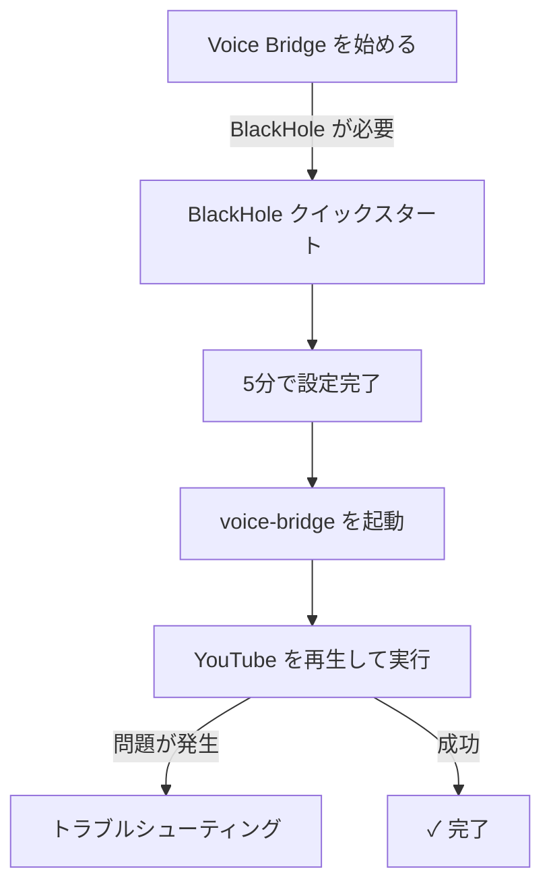

# Voice Bridge ドキュメント

Voice Bridge の導入から操作、トラブルシューティングまで、各種ガイドが揃っています。

---

## 📚 ドキュメント一覧

### BlackHole（オーディオキャプチャ）
macOS でシステム音声をキャプチャするための仮想デバイス BlackHole の導入・操作ガイド

| ドキュメント | 対象者 | 読むべき時間 |
|---|---|---|
| **[BlackHole クイックスタート](./BLACKHOLE_QUICK_START.md)** | 初めての方、急ぐ方 | 5分 |
| **[BlackHole 詳細マニュアル](./BLACKHOLE_MANUAL.md)** | 詳しく知りたい方 | 30分 |
| **[BlackHole トラブルシューティング](./BLACKHOLE_TROUBLESHOOTING.md)** | 問題が発生した方 | 問題による |

### セットアップガイド
- **[セットアップガイド](../setup_guide.md)** - 環境構築手順（macOS/Windows）

### 機能ドキュメント
- **[GUI 改善](./GUI_IMPROVEMENTS.md)** - GUI の見方と改善内容
- **[統合ガイド](./INTEGRATION_GUIDE.md)** - 各コンポーネントの統合方法
- **[ビルドガイド](./BUILD.md)** - ビルドと配布方法

### トラブルシューティング
- **[修正レポート](./MISTRANSLATION_FIX.md)** - 翻訳精度の改善
- **[ボタン修正](./BUTTON_FIX_MACOS_COMPATIBLE.md)** - macOS 互換性修正

---

## 🚀 クイックスタート

### 初めての方

**推奨フロー**：

1. **[BlackHole クイックスタート](./BLACKHOLE_QUICK_START.md)** （5分）
2. **[セットアップガイド](../setup_guide.md)** （10分）
3. **voice-bridge を起動してテスト** （5分）
4. 問題が発生したら **[トラブルシューティング](./BLACKHOLE_TROUBLESHOOTING.md)** を参照

---

## 🔍 ドキュメントの探し方

### 「〇〇したい」別に探す

#### インストール・初期セットアップ
- **BlackHole をインストールしたい** → [クイックスタート](./BLACKHOLE_QUICK_START.md#ステップ-1-インストール1分)
- **複合デバイスを作成したい** → [クイックスタート](./BLACKHOLE_QUICK_START.md#ステップ-2-複合デバイス作成3分)
- **voice-bridge を起動したい** → [セットアップガイド](../setup_guide.md#アプリの起動)

#### 使い方・操作方法
- **voice-bridge の基本的な使い方を知りたい** → [BlackHole マニュアル - 使用方法](./BLACKHOLE_MANUAL.md#使用方法)
- **GUI の見方を知りたい** → [セットアップガイド - GUI の見方](../setup_guide.md#gui-の見方)
- **コマンドラインオプションを知りたい** → [セットアップガイド - 起動オプション](../setup_guide.md#起動オプション)

#### トラブルシューティング
- **入力レベルが動かない** → [トラブルシューティング - Q0](./BLACKHOLE_TROUBLESHOOTING.md#q0-入力レベルが反応しない)
- **英語が認識されない** → [トラブルシューティング - Q1](./BLACKHOLE_TROUBLESHOOTING.md#q1-whisper-が認識しない)
- **翻訳されない** → [トラブルシューティング - Q2](./BLACKHOLE_TROUBLESHOOTING.md#q2-翻訳されない)
- **音声が出ない** → [トラブルシューティング - Q3](./BLACKHOLE_TROUBLESHOOTING.md#q3-tts音声出力が出ない)
- **BlackHole が見つからない** → [トラブルシューティング - Q0.1](./BLACKHOLE_TROUBLESHOOTING.md#q01-blackhole-が-input-device-として表示されない)

#### その他
- **Windows での設定方法** → [セットアップガイド - Windows](../setup_guide.md#windows-セットアップ)
- **VOICEVOX について** → [セットアップガイド - VOICEVOX](../setup_guide.md#voicevox-のセットアップ推奨)
- **複合デバイスを削除したい** → [BlackHole マニュアル - FAQ](./BLACKHOLE_MANUAL.md#q-複合デバイスを削除したい場合は)

---

## 📖 ドキュメント概要

### BlackHole クイックスタート
**ページ数**: 1 ページ
**所要時間**: 5 分
**内容**: インストール → 複合デバイス作成 → 動作確認を最短で完了

**対象者**: 初めての方、とにかく早く始めたい方

---

### BlackHole 詳細マニュアル
**ページ数**: 10 ページ（この README 含む）
**所要時間**: 30 分（全読）/ 10 分（必要部分のみ）
**内容**:
- BlackHole の概要と必要性
- インストール方法（2 種類）
- 複合デバイスの詳細な作成手順
- 設定確認と使用方法
- トラブルシューティング（簡易版）
- 技術詳細
- よくある質問（FAQ）

**対象者**: 詳しく理解したい方、トラブル時の参考資料

---

### BlackHole トラブルシューティング
**ページ数**: 8 ページ
**所要時間**: 問題による（5～30 分）
**内容**:
- 診断フローチャート
- 問題別の詳細な原因分析と解決方法
- チェックリスト
- コマンドラインでの診断方法
- よくある質問

**対象者**: 問題が発生した方、診断方法を知りたい方

---

## ⚙️ システム情報

### 対応 OS
- **macOS** 10.12 以上
- **Windows** 10 / 11

### 対応ブラウザ
- Chrome（Chrome 拡張機能を使用する場合）
- 他のブラウザ（Python アプリケーションのため制限なし）

### システム要件
- **macOS**:
  - Python 3.9+
  - BlackHole 2ch
  - 4GB RAM 以上（推奨）

- **Windows**:
  - Python 3.9+
  - 4GB RAM 以上（推奨）

---

## 🔗 関連リンク

### 公式サイト
- [BlackHole 公式サイト](https://existential.audio/blackhole/)
- [VOICEVOX 公式サイト](https://voicevox.hiroshiba.jp/)

### Voice Bridge プロジェクト
- [GitHub リポジトリ](https://github.com/your-repo)
- [Issues](https://github.com/your-repo/issues)

### 関連ドキュメント
- [Agent Guide](../AGENTS.md)
- [セットアップガイド](../setup_guide.md)

---

## 💡 よくある質問（クイック Q&A）

### BlackHole について

**Q. BlackHole は無料か？**
A. はい、完全無料です。

**Q. blackHole をアンインストールしたい**
A. [マニュアルの FAQ](./BLACKHOLE_MANUAL.md#q-blackhole-をアンインストールしたい場合は) を参照

**Q. Windows では BlackHole は必要か？**
A. いいえ。Windows では WASAPI ループバック（自動設定）を使用します。

### voice-bridge について

**Q. Python のバージョンは？**
A. Python 3.9 以上が必要です。

**Q. 日本語動画の翻訳はできるか？**
A. 現在は英語→日本語翻訳のみです。日本語入力の場合は、コード改修が必要です。

**Q. オフラインで使用できるか？**
A. 翻訳に Google Translate を使用しているため、インターネット接続が必須です。

---

## 🚨 問題報告・フィードバック

### バグ報告
GitHub Issues で報告してください：
1. どの手順で問題が発生したか
2. エラーメッセージ全文
3. 環境情報（macOS バージョン、Python バージョン等）
4. 診断ログの出力結果（トラブルシューティング参照）

### 改善提案
こちらも GitHub Issues で：
- 「Enhancement」ラベルを付けて報告

---

## 📝 ドキュメント更新履歴

| 日付 | 更新内容 |
|---|---|
| 2026-02-26 | BlackHole マニュアル 3 部作を作成（クイックスタート、詳細マニュアル、トラブルシューティング） |
| 2026-02-25 | 既存ドキュメント整理 |

---

## 📄 ライセンス

Voice Bridge のドキュメントは [CC BY-SA 4.0](https://creativecommons.org/licenses/by-sa/4.0/) の下で提供されています。

---

**最終更新**: 2026-02-26
**管理者**: Voice Bridge Team
