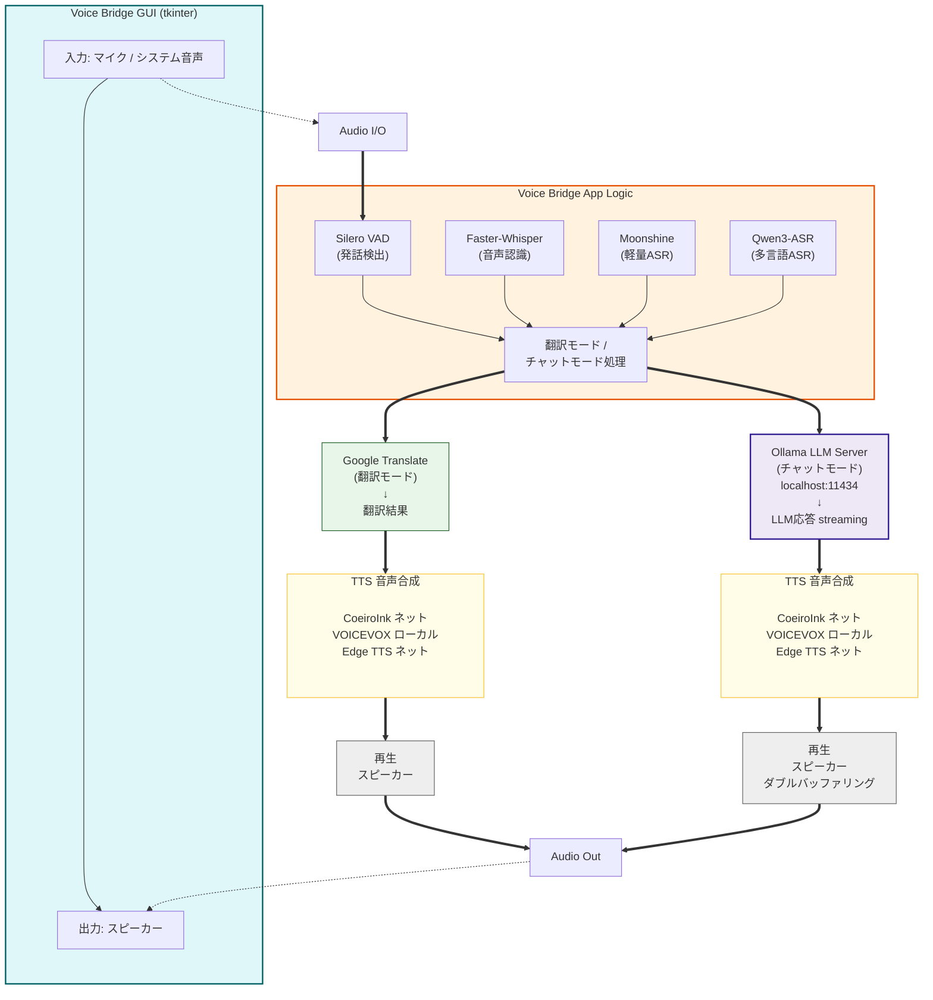

# システムアーキテクチャ

Voice Bridge の全体設計、ネットワーク接続、処理パイプライン、およびコンポーネント構成を説明します。

## ネットワーク接続図



## 処理パイプライン

### 翻訳モード

```
音声キャプチャ → ASR認識 → Google翻訳 → TTS音声合成 → 再生
```

1. **音声キャプチャ** — システム音声またはマイク入力を録音
2. **ASR認識** — Faster-Whisper、Moonshine、または Qwen3-ASR で音声をテキスト化（自動言語検出対応）
3. **Google翻訳** — deep-translator を使用して翻訳
4. **TTS音声合成** — CoeiroInk / VOICEVOX / Edge TTS で読み上げ
5. **再生** — スピーカーから出力

### チャットモード（Ollama を利用）

```
マイク → VAD発話検出 → ASR認識 → Ollama LLM応答(streaming)
                                    ↓
                         TTS文単位合成 → 再生
                          ↓                ↓
                    1文目を再生しながら   2文目を合成
                    （ダブルバッファリング）
```

チャットモードでは以下の最適化により低遅延を実現しています。

| 最適化 | 効果 |
|---|---|
| Silero VAD | 発話終了を 0.8s で検出（従来 RMS: 6s+） |
| LLM ストリーミング | トークン単位で逐次受信、文単位で TTS に渡す |
| TTS ダブルバッファリング | 1文目再生中に2文目を合成（初回音声 ~0.5s） |

## コンポーネント

### 音声処理

| コンポーネント | 技術 | 説明 |
|---|---|---|
| 音声認識 | Faster-Whisper / Moonshine / Qwen3-ASR | 音声 → テキスト（7言語対応・自動検出） |
| 発話検出 | Silero VAD / RMS | 自然な発話終了検出 |

### 翻訳・AI

| コンポーネント | 技術 | 説明 |
|---|---|---|
| 翻訳 | Google Translate（deep-translator） | テキスト翻訳 |
| AI チャット | OpenAI 互換 API | Ollama / LM Studio / OpenAI |

### 音声合成

| コンポーネント | 対応言語 | 説明 |
|---|---|---|
| CoeiroInk | 日本語 | リリンちゃん等のキャラクターボイス |
| VOICEVOX | 日本語 | ずんだもん等のキャラクターボイス |
| Edge TTS | 多言語 | Microsoft Edge 音声合成 |

### 音声 I/O

| コンポーネント | 説明 |
|---|---|
| sounddevice | クロスプラットフォーム音声 I/O |
| BlackHole + sounddevice | macOS システム音声キャプチャ |
| WASAPI | Windows システム音声キャプチャ |
| PulseAudio/PipeWire | Linux システム音声キャプチャ |

### UI

| コンポーネント | 説明 |
|---|---|
| tkinter | GUI フレームワーク |

## 新機能（v4）

### 言語自動検出
ソース言語を `auto` に設定すると、ASR が検出した言語に応じて翻訳ペアを動的に切り替えます。安定化のため、75% 以上の確信度で2回連続同一言語を検出した場合のみ切替が行われます。Whisper と Qwen3-ASR で利用可能です。

### TTS フィードバックループ防止
BlackHole 等のループバックデバイス使用時、TTS 再生音が ASR に再入力されるフィードバックループを防止します。TTS 再生中はキャプチャを抑制し、再生後にバッファをフラッシュします。

### レイテンシ計測
パイプラインの各ステージ（ASR・翻訳・TTS）の処理時間をリアルタイムで計測し、GUI に表示します。チャンク蓄積時間を含む合計遅延も記録されます。

### チャンク長動的調整
GUI スライダーで音声チャンク長（1.5〜6.0秒）をリアルタイムに変更可能。短いチャンクは低遅延、長いチャンクは高精度です。

## 動作環境

### 対応 OS

- **macOS** 10.12+
- **Windows** 10 / 11
- **Linux**（PulseAudio or PipeWire）

### 必須環境

- Python 3.9+
- メモリ 4GB以上（8GB推奨）
- インターネット接続（LLM、翻訳サービス利用時）

## 処理遅延の分解

### チャットモード

チャットモード（VAD + Whisper + Gemma 2-9B + TTS）での実測値：

```
マイク入力
    ↓ (0-0.8s) — 発話検出（VAD）
ASR 認識 (0.5-1.2s) — Whisper small
    ↓
LLM 処理 (0.3-0.8s per token)
    ↓
TTS 合成 (0.2-0.5s per sentence)
    ↓
スピーカー出力
───────────
合計: 0.9-2.5s（初回は 0.4s）
```

ダブルバッファリングにより、1文目の音声再生中に2文目を並列処理し、ユーザーの体感遅延を最小化しています。

### 翻訳モード

翻訳モードでの実測値（Whisper small, chunk=4.0s）:

```
音声チャンク蓄積 (4.0s) — 遅延の主因
    ↓
ASR 認識 (1.0-2.5s)
    ↓
翻訳 (0.3-0.5s)
    ↓
TTS 合成 (0.5-1.0s)
───────────
合計: 6.0-8.0s
```

チャンク長を 2.0s に短縮することで合計 4.0-6.0s まで削減可能。

## 技術スタック

### Python ライブラリ（主要）

- **faster-whisper** — 高速音声認識
- **moonshine** — 軽量音声認識（英語向け）
- **qwen-asr** — Qwen3-ASR 多言語音声認識
- **silero-vad** — 発話検出
- **deep-translator** — テキスト翻訳
- **requests / httpx** — HTTP クライアント
- **sounddevice** — 音声 I/O

### 外部サービス

- **Google Translate API** — 翻訳
- **Ollama / LM Studio** — ローカル LLM サーバー
- **CoeiroInk API** — 音声合成（リリンちゃん）
- **VOICEVOX API** — 音声合成（ずんだもん等）
- **Microsoft Edge TTS** — 音声合成（多言語）
